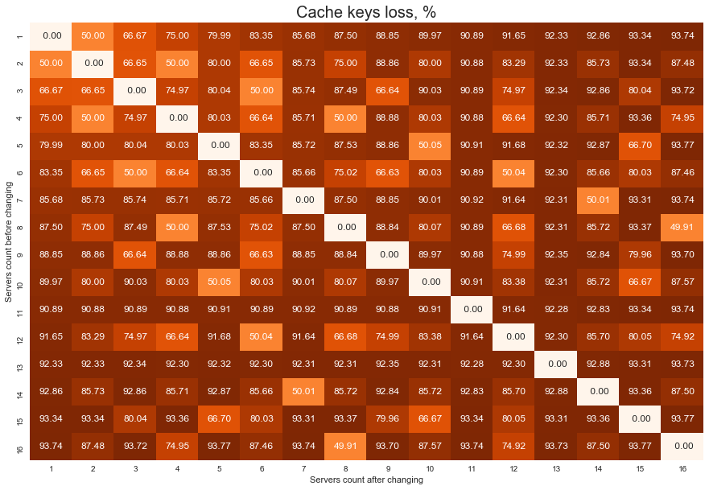
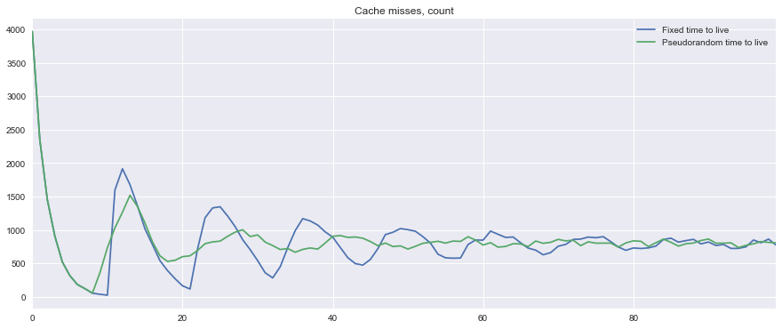

## Cache Simulation Scripts [](https://travis-ci.org/pryazhnikov/cache-simulations)

[Русская версия](README.ru.md)

This repo contains additional materials for [caching problems article](https://badootech.badoo.com/working-with-a-cache-problems-and-solutions-php-36ed76451ac).

File structure:

```
  data/                      - CSV files with script built data
  image_sources/             - image source files
  images/                    - rady to use images (schemes & visualizations)
  run_cold_start.php         - a script for a synthetic test of system start with an empty cache
  run_modulo_resharding.php  - a script for calculating the cache loss on servers count change
  visualization.ipynb        - Jupyter notebook with data visualizations
```

## How to run the scripts?


PHP 7.1+ is mandatory to run the scripts.

```
# Emulating the problem of system start with an empty cache

## Using 10K unique users in the system, getting 1K requests per second,
## looking at the system for 200 seconds, using a fixed cache lifetime
./run_cold_start.php --rps=1000 --users=10000 --time=200

## The same, but using the pseudo-random cache lifetime instead of the fixed one.
./run_cold_start.php --rps=1000 --users=10000 --time=200 --random

# The cache loss on servers count change

## Consider for the case with 100 thousand keys and for the situation with 4 and 5 servers
./run_modulo_resharding.php --keys=100000 --servers=4,5

## Consider for the case with 100 thousand keys and for the situation with 1-10 servers
./run_modulo_resharding.php --keys=10000 --servers="1-10"

```

##  Visualization examples

### Cache loss percent on servers count change



### Cache miss peaks smoothing on system start with an empty cache


