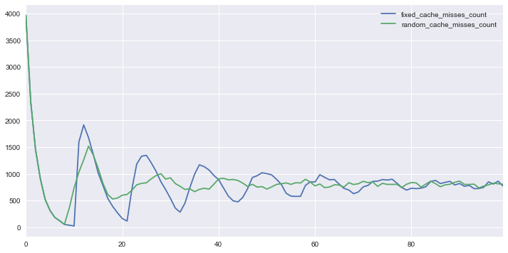

## Скрипты для симуляции работы кэша

Этот репозиторий содержит вспомогательные материалы для статьи про кэширование.

Файловая структура:

```
  data/                      - CSV файлы с данными, сгенерированными скриптами
  images/                    - готовые изображения-визуализации сгенерированных данных
  run_cold_start.php         - скрипт для синтетического теста старта системы с непрогретым кэшом
  run_modulo_resharding.php  - скрипт для расчёта потерь кэша при изменении количества серверов
  visualization.ipynb        - Jupyter блокнот, визуализирующий сгенерированные данные
```

## Как запускать скрипты?

Для работы скриптов необходим PHP 7.1 и выше.

```
# Эмуляция проблемы старта системы с непрогретым кэшом

## В системе 10 тысяч пользователей, получаем 1 тысячу запросов в секунду,
## наблюдаем за системой 200 секунд, используем фиксированное время жизни кэша.
./run_cold_start.php --rps=1000 --users=10000 --time=200

## То же самое, но с использованием псевдослучайного времени жизни кэша.
./run_cold_start.php --rps=1000 --users=10000 --time=200 --random

# Потери кэша при изменении количества серверов

## Считать для 100 тысяч ключей и для ситуации с 4 и 5 серверами
./run_modulo_resharding.php --keys=100000 --servers=4,5

## Считать для 100 тысяч ключей и для ситуации от 1 до 10 серверов
./run_modulo_resharding.php --keys=10000 --servers="1-10"

```

##  Примеры визуализаций

### Потери кэша


### Сглаживание пиков нагрузки при старте системы без кэша


